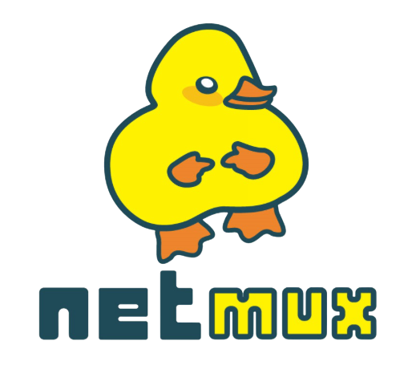

# Netmux

Dux - the King of Mux

Logo art by Ceci - Cecilia Simão / Grande - Marcelo Grandioso (Gaudioso)

This is netmux, a network multiplexer and meshing platform.
It was designed to make your life easier and more enjoyable when
developing your container based services and/or doing work on remote infra.

We plan to support bare-metal shortly - and other use cases will come.

For installation instructions, please refer to the [installation guide.](./zarf/docs/guides/install.md)

For Kubernetes usage, please refer to the [using kubernetes guide.](./zarf/docs/guides/using-kubernetes.md)

## Sponsors

Digital Circle - https://www.digitalcircle.com.br