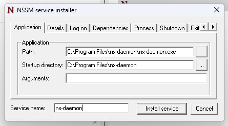
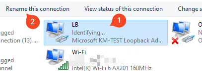
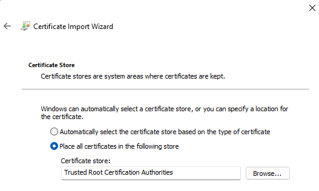

# Installation Guide

There are multiple possibilities to apply netmux, this guide will explore each as they become available.

1. Kubernetes - Please check [guide.](using-kubernetes.md)
2. Docker (In progress)
3. Bare Metal (In progress)

The following components will be required anyhow, and have specific installation guides depending on your OS:

1. Netmux Daemon
2. Netmux Cli

In order to build them you can call (once you clone the repo) the following command:

```shell
make my-bins
```

Your binaries will be created under `zarf/dist`

Please add `nx` to a folder in your path and `nx-daemon` to a dedicated folder - this place will vary depending on your 
os, so please see specific guides below.

Alternatively, you can grab the latest bins from the releases in the project.

## Macos

### Installing the Daemon:

1. Place the binary in a proper folder - we suggest /usr/local/nx-daemon
2. Copy the plist file to /Library/LaunchDaemons
3. Run `sudo launchctl load -w /Library/LaunchDaemons/nx-daemon.plist`

### Uninstall

1. Run `sudo launchctl unload -w /Library/LaunchDaemons/nx-daemon.plist`
2. Remove the binary and the plist file

### Manual start
`sudo launchctl start -w /Library/LaunchDaemons/nx-daemon.plist`

### Manual stop
`sudo launchctl stop -w /Library/LaunchDaemons/nx-daemon.plist`

#### nx-daemon.plist

```xml
<?xml version="1.0" encoding="UTF-8"?>
<!DOCTYPE plist PUBLIC "-//Apple//DTD PLIST 1.0//EN" "http://www.apple.com/DTDs/PropertyList-1.0.dtd">
<plist version="1.0">
  <dict>
    <key>EnvironmentVariables</key>
    <dict>
      <key>PATH</key>
      <string>/usr/local/bin:/usr/bin:/bin:/usr/sbin:/sbin:</string>
    </dict>
    <key>UserName</key>
	<string>root</string>
	 <key>GroupName</key>
    <string>wheel</string>
    <key>Label</key>
    <string>nx-daemon</string>
    <key>Program</key>
    <string>/usr/local/nx/nx-daemon</string>
    <key>RunAtLoad</key>
    <true/>
    <key>KeepAlive</key>
    <true/>
    <key>LaunchOnlyOnce</key>
    <true/>
    <key>StandardOutPath</key>
    <string>/tmp/nx-daemon.stdout</string>
    <key>StandardErrorPath</key>
    <string>/tmp/nx-daemon.stderr</string>
	<key>WorkingDirectory</key>
	<string>/usr/local/nx</string>
  </dict>
</plist>
```

## Linux

Once you got the binaries, we propose you create a folder called `/srv/nx-daemon`, and put both nx-daemon and nx
there.

Add this folder to your path, add the following line to your `.bashrc`:

```
export PATH=/srv/nx-daemon:$PATH
```

At the end of the file. Then call `source ~/.bashrc` and your path should be updated.

Create a nx-daemon config file as explained above.

The following steps should be executed as ROOT:

Create a systemd file called /etc/systemd/system/nx-daemon.service - please replace <USER> with your username

```
[Unit]
Description=NX Daemon

[Service]
Type=simple
User=root
Restart=always
WorkingDirectory=/srv/nx-daemon
ExecStart=/srv/nx-daemon/nx-daemon

[Install]
WantedBy=multi-user.target
```

After this, reload the services with `systemctl daemon-reload`.

Finally, make it start w your system with `systemctl enable nx-daemon.service`.

Check if your daemon has started correctly with `systemctl status nx-daemon`. 

Start the daemon - it will generate the certificates to allow communication between cli and the daemon.

Files will be saved in the `/srv/nx-daemon`

### For Specific Linux distros

#### Fedora
Copy the file `ca.cer` from `/srv/nx-daemon` to `/etc/pki/ca-trust/source/anchors/netmux.crt`

#### Ubuntu
Copy the file `ca.cer` from `/srv/nx-daemon` to `/usr/local/share/ca-certificates/netmux.crt`

#### ALL

Update the trusted store with the command `update-ca-trust`

now you can start playing w nx command.

## Windows

Download the binaries

Save them in a new folder `c:\Program Files\nx-daemon`

Downloand and install nssm from https://nssm.cc

Save nssm.exe in the same folder

From there open command prompt and run `nssm install`



Fill in data as shown, press install.

Create the `netmux.yaml` file in there

Create a virtual network adapter:

1. right click start button -> Device manager
2. select your PC at the top (otherwise menu item will be missing)
3. menu "Action" -> "Add legacy hardware"
4. next -> "install the hardware that I manually selectron from a list (Advanced)" -> next
5. select "network adapters" -> next -> wait until list is loaded
6. In the Manufacturer list, select Microsoft. In the Model list, select Microsoft KM-TEST Loopback Adapter
next -> finish
7. can be found where the other network adapters are. It is usually called "Ethernet 2" or something like that.

Once created go to network connections, find it there and rename it to `LB`



Once done, start it with cmd line `sc start nx-daemon`

With certificates generated, please ensure to add ca.cer to the list of trusted certificates, by double clicking
on it. 


The key detail here is to ensure the cert is added to the `Trusted Root Certification Authorities`


## Running the Daemon

The Daemon will look for a file called `netmux.yaml` in its working directory it is running.

This file describes the endpoints you may access.

At the moment, every change in this file will require netmux to be restarted.

```yaml
#the default used ip addresses will be in the range 10.10.10.0/24, but can be customized here.
network: 10.1.0.0/24

endpoints:
  - name: local
    endpoint: netmux:50000
    kubernetes:
      config: /Users/psimao/.kube/config
      namespace: netmux
      endpoint: netmux
      port: 50000
      context: orbstack
  - name: oci
    endpoint: netmux:50000
    kubernetes:
      config: /Users/psimao/.kube/oci
      namespace: netmux
      endpoint: service/netmux # netmux
      port: 50000
      context: context-cijdv4im6wa
      user: psimao
      kubectl: /opt/homebrew/bin/kubectl
```

> Important: please note, that if you need to use special authenticators to connect to k8s cluster, you may 
> add user and kubectl path to your endpoint config. In this case netmux will spawn portforwad by calling
> kubectl impersonating the user as named in the config - so we expect to find the cloud management cli tool
> in the path, allowing proper authentication and port forward to be setup. If these values are not provided,
> netmux will use the traditional API approach.

## Installing on Kubernetes

### RBAC 
Netmux will require special accesses to monitor your namespace, so we 1st will need to address rbac:

```yaml
apiVersion: rbac.authorization.k8s.io/v1
kind: Role
metadata:
  name: netmux
rules:
  - apiGroups: [ "" ]
    resources: [ "nodes", "services", "pods", "endpoints" ]
    verbs: [ "get", "list", "watch" ]
  - apiGroups: [ "extensions" ]
    resources: [ "deployments" ]
    verbs: [ "get", "list", "watch" ]

---

apiVersion: v1
kind: ServiceAccount
metadata:
  name: netmux

---

apiVersion: rbac.authorization.k8s.io/v1
kind: RoleBinding
metadata:
  name: netmux
subjects:
  - kind: ServiceAccount
    name: netmux # name of your service account
    namespace: netmux # this is the namespace your service account is in
roleRef: # referring to your ClusterRole
  kind: Role
  name: netmux
  apiGroup: rbac.authorization.k8s.io

```

### Deployment

Once RBAC is set we can deploy it like this:

```yaml
kind: Deployment
apiVersion: apps/v1
metadata:
  name: netmux
spec:
  replicas: 1
  selector:
    matchLabels:
      app: netmux
  template:
    metadata:
      labels:
        app: netmux
    spec:
      serviceAccountName: netmux

      containers:
        - name: netmux
          image: duxthemux/netmux:latest
          imagePullPolicy: IfNotPresent
          livenessProbe:
            httpGet:
              port: 8083
              path: /live
          readinessProbe:
            httpGet:
              port: 8083
              path: /ready
            initialDelaySeconds: 5
            periodSeconds: 5
          env:
            - name: LOGLEVEL
              value: debug
            - name: LOGSRC
              value: "false"
          ports:
            - containerPort: 50000
              protocol: TCP
              name: netmux-data
            - containerPort: 8082
              protocol: TCP
              name: prometheus
            - containerPort: 8083
              protocol: TCP
              name: probes

      imagePullSecrets:
        - name: reg
```

### Service

```yaml
apiVersion: v1
kind: Service
metadata:
  name: netmux
  namespace: netmux
  annotations:
    prometheus.io/scrape: 'true'
    prometheus.io.scheme: "http"
    prometheus.io/port: "8082"
    nx: |-
      - name: netmux-prom
        direction: L2C
        remotePort: "8082"
        localPort: "8082"
        localAddr: netmux-prom
spec:
  ports:
    - port: 50000
      name: netmux
      protocol: TCP
      targetPort: 50000
    - port: 8082
      name: prometheus
      protocol: TCP
      targetPort: 8082
    - port: 8083
      name: probes
      protocol: TCP
      targetPort: 8083
  selector:
    app: netmux
```